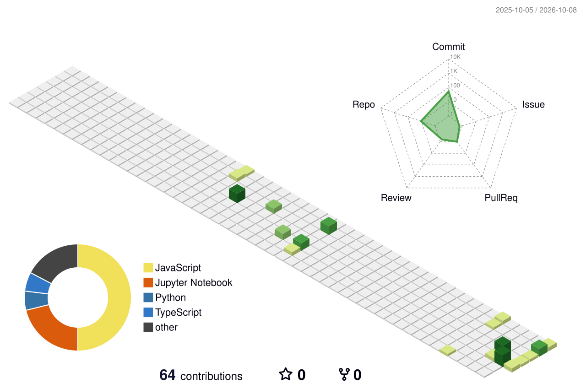

<div align="center">

# 👋 Hi, I'm Kanka Das

### 💻 Aspiring Software Engineer | Full-Stack Developer | AI/ML Enthusiast

<p>
  <a href="https://github.com/kanka-317">
    
  </a>
  <a href="https://www.linkedin.com/in/kanka-das-a48295333/">
    
  </a>
  <a href="mailto:daskanka20@gmail.com">
    
  </a>
  <a href="https://www.instagram.com/egoistic_not_serious_kanka/">
    
  </a>
  <a href="https://www.facebook.com/kanka.das.5477">
    
  </a>
</p>

<!-- FIX: direct image embed; do NOT wrap the counter in another link -->


</div>

---

## 🧑‍💻 About Me

I'm an aspiring **Software Engineer and Computer Science student** interested in building practical software and AI-powered applications.

```text
🎓 B.Tech — Computer Science & Engineering
📊 CGPA — 8.19 / 10.00 (up to 6th semester)
📍 Kolkata, West Bengal, India

⚡ Focus Areas
├── Full-Stack Web Development
├── Machine Learning & Deep Learning
├── Generative AI & NLP
├── Data Structures & Algorithms
└── Real-World AI Applications
```

---

## 🛠️ Tech Stack

### 💻 Languages
<p>


</p>

### 🌐 Frontend
<p>


</p>

### ⚙️ Backend
<p>


</p>

### 🗄️ Databases
<p>


</p>

### 🤖 AI / ML / Data
<p>


</p>

### 🧠 Generative AI
<p>


</p>

### 🔧 Tools
<p>


</p>

---

# 🚀 Featured Projects

### 🌦️ WeatherGPT
Conversational AI weather application focused on weather information, forecasting and alerts.

🔗 **Repository:** [WeatherGPT](https://github.com/kanka-317/WeatherGPT)

### 📊 StatSkill AI
AI-powered skill profiling and skill-gap project.

🔗 **Repository:** [StatSkill-AI](https://github.com/kanka-317/StatSkill-AI)

### 🎓 CurricuTrack
Smart education / curriculum-oriented project.

🔗 **Repository:** [CurricuTrack](https://github.com/kanka-317/CurricuTrack)

### 🛒 E-Commerce App
Full-stack e-commerce application.

🔗 **Repository:** [E-commerce--app](https://github.com/kanka-317/E-commerce--app)

### 🏋️ Fitness Tracker
Web-based fitness tracking project.

🔗 **Repository:** [fitness-tracker](https://github.com/kanka-317/fitness-tracker)

### 🌾 Crop Prediction
Machine-learning crop prediction project.

🔗 **Repository:** [Cropprediction](https://github.com/kanka-317/Cropprediction)

### 📧 Spam SMS Detection
Machine-learning / NLP classification project.

🔗 **Repository:** [spam-sms-detection](https://github.com/kanka-317/spam-sms-detection)

### 🏠 House Price Prediction
Python-based house price prediction project.

🔗 **Repository:** [house_price](https://github.com/kanka-317/house_price)

### ✨ AI Post Maker
AI-assisted social/media post generation project.

🔗 **Repository:** [ai-post-maker](https://github.com/kanka-317/ai-post-maker)

---

## 🏆 Achievements

<p align="center">


</p>

- ✅ Solved **50+ DSA problems** on GeeksforGeeks
- 🏆 Participated in **Smart India Hackathon (SIH)**
- 💻 Active in coding contests on HackerRank

---

# 📊 GitHub Analytics

<div align="center">


<br><br>


</div>

---

# 🏆 GitHub Trophies

<div align="center">


</div>

---

# 🐍 Animated Contribution Snake

<picture>
  <source media="(prefers-color-scheme: dark)" srcset="./output/github-snake-dark.svg">
  <source media="(prefers-color-scheme: light)" srcset="./output/github-snake.svg">
  
</picture>

---

# 🧊 3D GitHub Contribution Calendar

> This image is generated automatically by GitHub Actions.

<div align="center">



</div>

---

# 📈 Contribution Activity

<div align="center">


</div>

---

## 🎓 Certifications & Training

- Complete Full Stack Web Development Bootcamp (AI Integrated)
- Java Programming — IIT Bombay Spoken Tutorial
- Android App Development
- AI/ML Industrial Training using Python
- Full Stack Web Development — MERN Stack

---

## 🎯 Current Focus

```text
Full-Stack Development
        +
Machine Learning
        +
Generative AI
        +
Data Structures & Algorithms
        ↓
Building Useful AI-Powered Products 🚀
```

---

## 🤝 Connect With Me

<p align="center">
  <a href="https://github.com/kanka-317">GitHub</a> •
  <a href="https://www.linkedin.com/in/kanka-das-a48295333/">LinkedIn</a> •
  <a href="mailto:daskanka20@gmail.com">Email</a>
</p>

<div align="center">

### ⭐ Thanks for visiting!

**`Code • Learn • Build • Repeat`**

</div>
